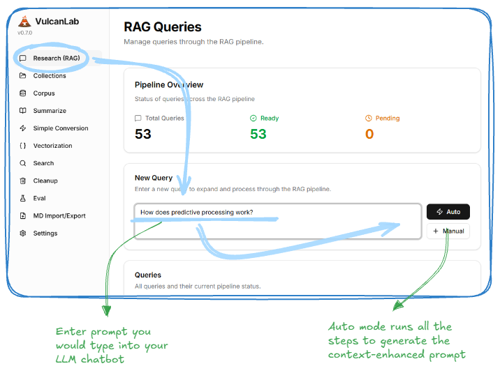
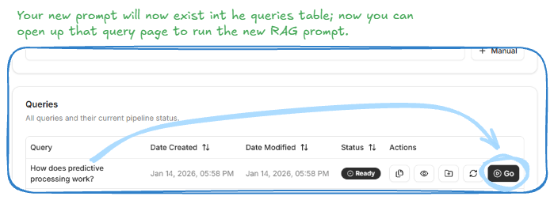
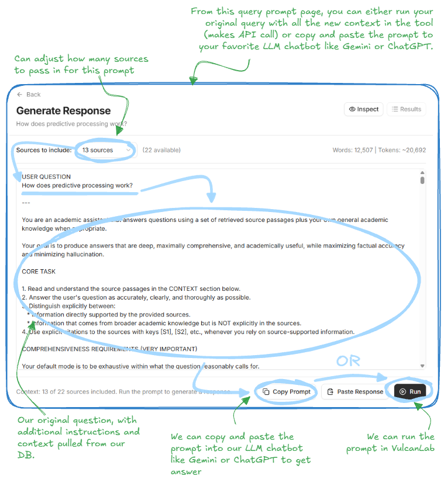
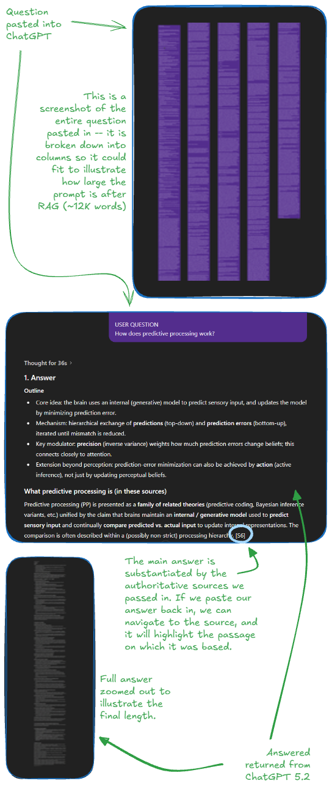
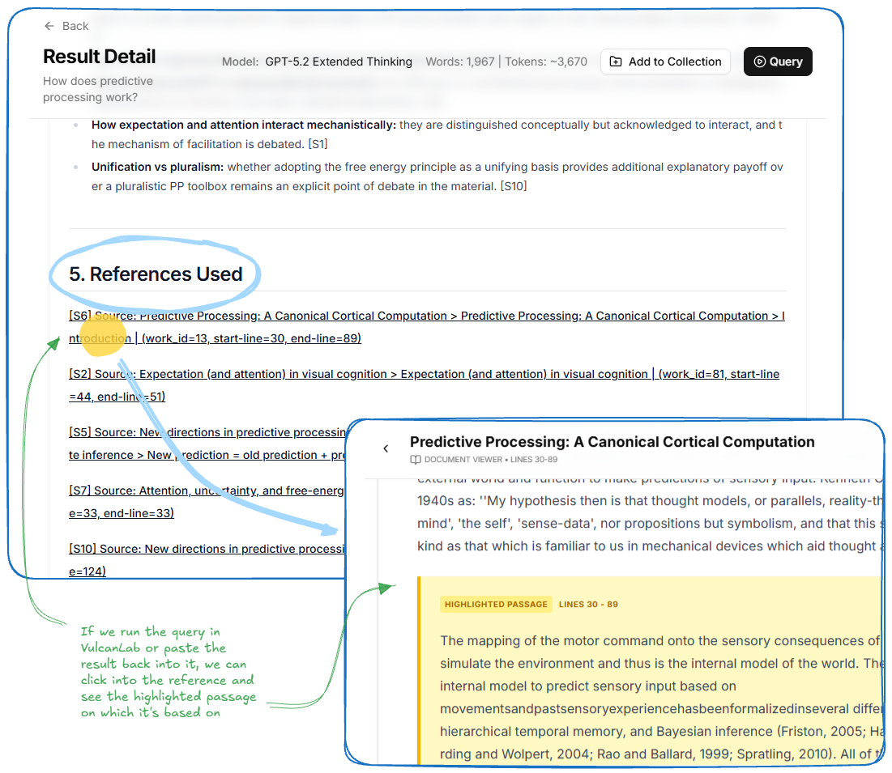

# Running RAG

## Step 1 - Enter your Research Query

1. Go to the Research (RAG) page
2. Type in the research questions as you might in your LLM chatbot
2. Click Auto to run the full process for generating the RAG expanded prompt

**What VulcanLab runs automatically:**

* **Query expansion:** One LLM call generates alternative phrasings of the question, related terms, and a few “hypothesis” angles to widen recall.
* **Retrieval + consolidation:** Those expanded queries run against our database; VulcanLab selects the strongest passages and clusters them into logical, related groups.
* **Prompt augmentation:** VulcanLab then builds a final prompt that includes our original question, the curated source context, and clear instructions for the LLM on how to use that evidence to produce a grounded answer.

At the end, we get a single “final query” that we can run directly inside VulcanLab or copy/paste into a chatbot like ChatGPT or Gemini.

## Step 2 - Show, Customize your RAG-expanded Query

Our query should now show up at the top of the "Queries" table:

1. Click "GO"

2. Adjust how many sources are going to be passed in (double check the token count)
3. Copy the prompt or run the query right in VulcanLab

## Step 3 - Results

If we copy the prompt into clipboard and paste it into an LLM like ChatGPT we then have the option of pasting the result back into VulcanLab. If we run it directly in VulcanLab our result is automatically saved in VulcanLab.

This shows what it might look like to run the query in ChatGPT:

*Note how large our prompt has become in this case. From "How does predictive processing work?" to a prompt with ~13K words! The prompt is shown broken down into columns*

## Step 4 - Inspect the References

We can confirm that our response is coherent based on the references linked at the bottom of the response (whether we copy and paste from our LLM or run directly in the tool, the references should get picked up). When clicking on one, it will go into that document and highlight the passage:

## Conclusion

VulcanLab is ultimately about making “deep research” practical: we get the speed and synthesis of an LLM, but grounded in a library we control, with enough context to be genuinely useful—and the ability to verify anything by jumping straight to the highlighted evidence. If there’s one takeaway, it’s that RAG isn’t a gimmick; when we feed it strong, authoritative sources, the quality jump is real, especially in completeness and academic depth. As the ecosystem matures, the goal is to keep pushing that workflow forward—easier ingestion, better search, richer collections—so we can spend less time hunting for information and more time building, writing, and making decisions with confidence.
